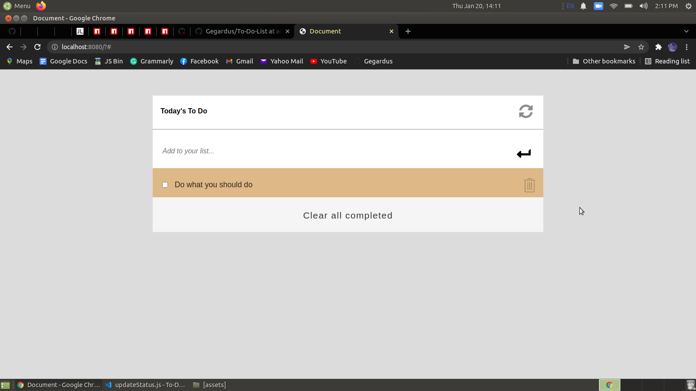

# Title

To Do list: add & remove

> This is a simple HTML list of To Do tasks.

## Built With

- HTML
- CSS
- JavaScript

## Getting Started

To get a local copy up and running follow these simple example steps:

### Prerequisites

clone repo: `https://github.com/Gegardus/To-Do-List/tree/addrmv`

then
`cd To Do List`

### Install

run `npm install` to install dependencies

## Contribute

Contributions, issues, and feature requests are welcome!

Feel free to check the [issues page](https://github.com/Gegardus/To-Do-List/issues)

## Author

👤 **Vahan Khachvankian**

- GitHub: https://github.com/Gegardus

## Acknowledgements

I highly appreciate the help in the project from the all my partners and mentor.

## 📝 License

This project is [MIT](./MIT.md) licensed.
